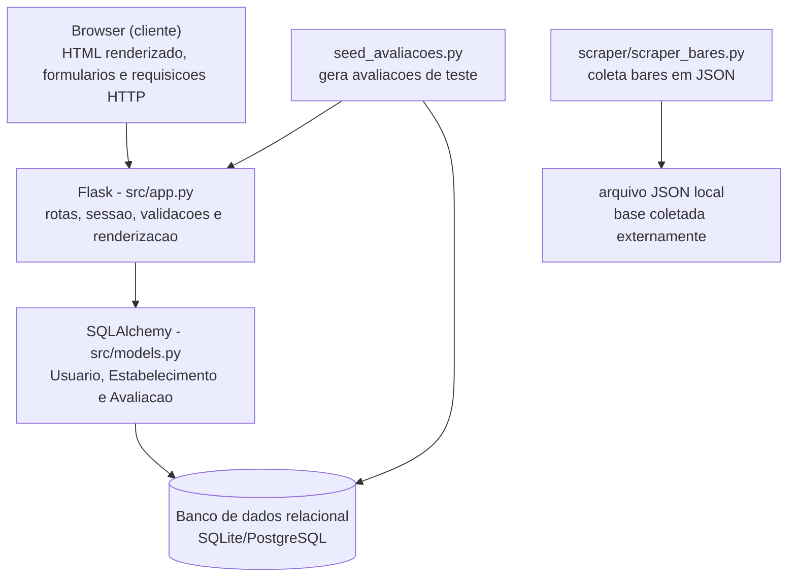
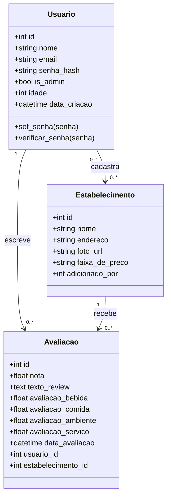
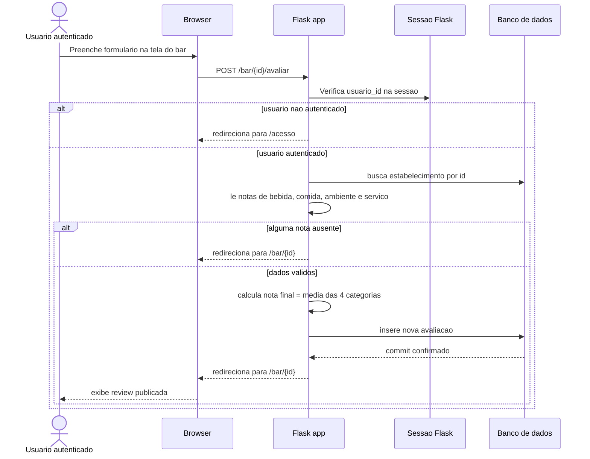

# TP1_EngSoftware

**Membros:** Bruno Lopes Melo Fonseca (Full stack), Gabriel Alkmim Barros (Full stack), Felipe Araujo Melo (Full stack)

## Sobre o projeto

O **Saideira** e uma aplicacao web em Flask voltada para descoberta e avaliacao de bares em Belo Horizonte. A proposta do sistema e funcionar como um diario social da vida noturna: usuarios podem criar conta, explorar estabelecimentos, publicar reviews com notas por categoria e acompanhar a reputacao de cada lugar.

Pelo codigo atual, o sistema possui tres eixos principais:

- exploracao publica de bares e avaliacoes
- autenticacao e gerenciamento de perfil
- administracao de estabelecimentos e usuarios

## Tecnologias

- Python
- Flask
- Flask-SQLAlchemy
- SQLAlchemy ORM
- SQLite ou PostgreSQL via `DATABASE_URL`
- HTML/CSS com templates Jinja2
- Playwright para scraping de bares

## Funcionalidades principais

- listar bares na pagina inicial com busca por nome
- visualizar detalhes e avaliacoes de um bar
- criar conta com validacao de idade minima
- fazer login e logout com sessao Flask
- editar perfil do usuario
- publicar avaliacao com notas separadas para bebida, comida, ambiente e servico
- cadastrar novos estabelecimentos como administrador
- listar e remover usuarios como administrador

## Documentacao UML preliminar

Os diagramas abaixo foram revisados a partir do codigo atual em `src/app.py`, `src/models.py`, `src/templates/`, `seed_avaliacoes.py` e `scraper/scraper_bares.py`.

Os dois tipos UML exigidos pelo trabalho estao cobertos por:

- **diagrama de classes**
- **diagrama de sequencia**

Os fluxogramas complementam a documentacao com uma visao mais direta de navegacao e arquitetura.

### 1. Fluxo funcional por perfil

Este fluxograma resume o que cada perfil consegue fazer e quais rotas aparecem no fluxo principal de uso.

```mermaid
flowchart TD
    H["/<br/>listar e buscar bares"]
    D["/bar/{id}<br/>ver detalhes e avaliacoes"]
    C["/cadastro<br/>criar conta"]
    L["/acesso<br/>entrar com email e senha"]
    P["/perfil<br/>editar nome, email, idade e senha"]
    A["POST /bar/{id}/avaliar<br/>enviar review com 4 categorias"]
    S["/sair<br/>encerrar sessao"]
    NB["/bar/adicionar<br/>cadastrar estabelecimento"]
    AU["/admin/usuarios<br/>listar usuarios"]
    DU["POST /admin/usuarios/deletar/{id}<br/>remover usuario comum"]

    subgraph Visitante
        H
        D
        C
        L
    end

    subgraph UsuarioAutenticado["Usuario autenticado"]
        P
        A
        S
    end

    subgraph Administrador
        NB
        AU
        DU
    end

    H --> D
    H --> C
    H --> L
    C --> P
    L --> P
    D -. requer login .-> A
    P --> S
    P -. se usuario.is_admin .-> NB
    P -. se usuario.is_admin .-> AU
    AU --> DU
```

### 2. Visao de componentes e responsabilidades

Este diagrama mostra como a aplicacao web se organiza entre interface, camada Flask, modelos, banco e scripts auxiliares.



### 3. Diagrama de classes do dominio

Este e o diagrama UML mais importante para entender o nucleo do sistema e a relacao entre usuarios, bares e reviews.



### 4. Diagrama de sequencia do fluxo de avaliacao

Este diagrama detalha a operacao central do sistema: publicar uma avaliacao de um bar.



## Regras de negocio observadas no codigo

- o cadastro exige idade minima de 18 anos
- o sistema tambem rejeita idades maiores ou iguais a 125 anos
- o email do usuario deve ser unico
- uma avaliacao so e aceita quando as quatro categorias sao informadas
- a `nota` final da avaliacao e a media aritmetica de bebida, comida, ambiente e servico
- apenas administradores podem cadastrar bares
- apenas administradores podem acessar o painel de usuarios
- administradores nao podem ser removidos pelo fluxo de exclusao
- ao deletar um usuario comum, os estabelecimentos cadastrados por ele nao sao apagados; o campo `adicionado_por` passa para `NULL`
- a sessao Flask armazena `usuario_id` e `usuario_nome` para controle de autenticacao

## Estrutura resumida do repositorio

```text
.
|-- README.md
|-- requirements.txt
|-- seed_avaliacoes.py
|-- scraper/
|   |-- scraper_bares.py
|   `-- bares.json
`-- src/
    |-- app.py
    |-- models.py
    |-- static/
    `-- templates/
```

## Historias de usuario atendidas

- como visitante, quero buscar bares disponiveis para conhecer a plataforma
- como usuario, quero criar conta usando email e senha
- como usuario registrado, quero fazer login com email e senha
- como usuario autenticado, quero editar meus dados pessoais
- como usuario autenticado, quero avaliar bares em categorias separadas
- como usuario, quero visualizar avaliacoes publicadas sobre um estabelecimento
- como administrador, quero adicionar novos bares
- como administrador, quero consultar e remover usuarios comuns

## Ferramentas de apoio utilizadas no desenvolvimento

- GPT
- Gemini
- Claude
- Copilot
