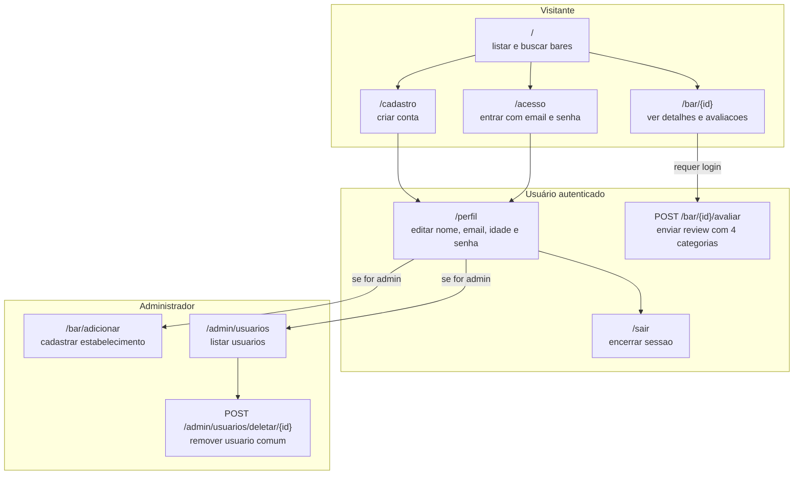
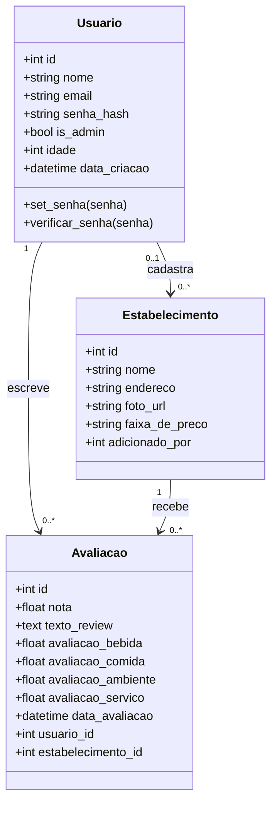

# TP1_EngSoftware

**Membros:** Bruno Lopes Melo Fonseca (Full stack), Gabriel Alkmim Barros (Full stack), Felipe Araujo Melo (Full stack)

## Sobre o projeto

O **Saideira** e uma aplicação web em Flask voltada para descoberta e avaliação de bares em Belo Horizonte. A proposta do sistema e funcionar como um diario social da vida noturna: usuários podem criar conta, explorar estabelecimentos, publicar reviews com notas por categoria e acompanhar a reputacao de cada lugar.

Pelo codigo atual, o sistema possui tres eixos principais:

- exploracao publica de bares e avaliacoes
- autenticacao e gerenciamento de perfil
- administracao de estabelecimentos e usuários

## Tecnologias

- Python
- Flask
- Flask-SQLAlchemy
- SQLAlchemy ORM
- SQLite ou PostgreSQL via `DATABASE_URL`
- HTML/CSS com templates Jinja2
- Playwright para scraping de bares

## Funcionalidades principais

- listar bares na pagina inicial com busca por nome
- visualizar detalhes e avaliacoes de um bar
- criar conta com validacao de idade minima
- fazer login e logout com sessao Flask
- editar perfil do usuário
- publicar avaliação com notas separadas para bebida, comida, ambiente e servico
- cadastrar novos estabelecimentos como administrador
- listar e remover usuários como administrador

## Documentacao UML preliminar


Os dois tipos UML exigidos pelo trabalho estao cobertos por:

- **diagrama de classes**
- **diagrama de sequencia**

Os fluxogramas complementam a documentacao com uma visao mais direta de navegacao e arquitetura.

### 1. Fluxo funcional por perfil

Este fluxograma resume o que cada perfil consegue fazer e quais rotas aparecem no fluxo principal de uso.



### 2. Visao de componentes e responsabilidades

Este diagrama mostra como a aplicação web se organiza entre interface, camada Flask, modelos, banco e scripts auxiliares.

```mermaid
flowchart TD
    Browser["Browser (cliente)<br/>HTML renderizado, formularios e requisicoes HTTP"]
    Flask["Flask - src/app.py<br/>rotas, sessao, validacoes e renderizacao"]
    Models["SQLAlchemy - src/models.py<br/>Usuario, Estabelecimento e avaliação"]
    DB[("Banco de dados relacional<br/>SQLite/PostgreSQL")]?
    Seed["seed_avaliacoes.py<br/>gera avaliacoes de teste"]
    Scraper["scraper/scraper_bares.py<br/>coleta bares em JSON"]
    JSON["arquivo JSON local<br/>base coletada externamente"]

    Browser --> Flask
    Flask --> Models
    Models --> DB
    Seed --> Flask
    Seed --> DB
    Scraper --> JSON
```

### 3. Diagrama de classes do dominio

Este e o diagrama UML mais importante para entender o núcleo do sistema e a relação entre usuários, bares e reviews.



### 4. Diagrama de sequencia do fluxo de avaliação

Este diagrama detalha a operação central do sistema: publicar uma avaliação de um bar.


## Regras de negocio 

- o cadastro exige idade minima de 18 anos
- o sistema também rejeita idades maiores ou iguais a 125 anos
- o email do usuario deve ser único
- uma avaliação só é aceita quando as quatro categorias são informadas
- a `nota` final da avaliação é a media aritmetica de bebida, comida, ambiente e serviço
- apenas administradores podem cadastrar bares
- apenas administradores podem acessar o painel de usuarios
- administradores não podem ser removidos pelo fluxo de exclusão
- ao deletar um usuário comum, os estabelecimentos cadastrados por ele não são apagados; o campo `adicionado_por` passa para `NULL`
- a sessão Flask armazena `usuario_id` e `usuario_nome` para controle de autenticação

## Estrutura resumida do repositório

```text
.
|-- README.md
|-- requirements.txt
|-- seed_avaliacoes.py
|-- scraper/
|   |-- scraper_bares.py
|   `-- bares.json
`-- src/
    |-- app.py
    |-- models.py
    |-- static/
    `-- templates/
```

## Histórias de usuário atendidas

- como visitante, quero buscar bares disponíveis para conhecer a plataforma
- como usuário, quero criar conta usando email e senha
- como usuário registrado, quero fazer login com email e senha
- como usuário autenticado, quero editar meus dados pessoais
- como usuário autenticado, quero avaliar bares em categorias separadas
- como usuário, quero visualizar avaliações publicadas sobre um estabelecimento
- como administrador, quero adicionar novos bares
- como administrador, quero consultar e remover usuários comuns

## Ferramentas de apoio utilizadas no desenvolvimento

- GPT
- Gemini
- Claude
- Copilot
